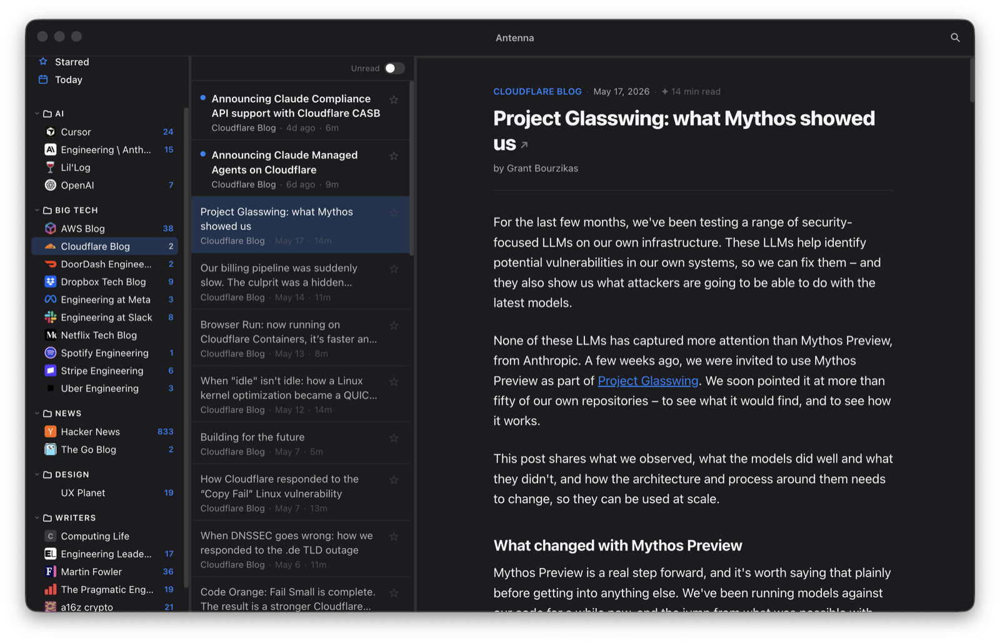
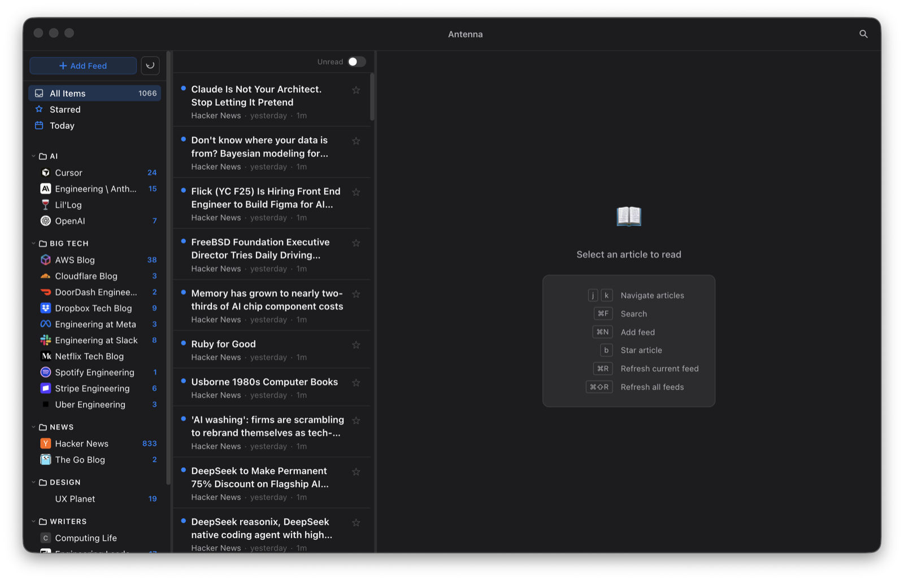

# Antenna

**Your daily read, curated for engineers.**

A native macOS RSS reader built for engineering blogs. Three-pane layout, permanent article archive, full-text search, and a curated starter set so you're reading from the moment you open it.

<p align="center">
  
</p>

## Download

**macOS (Apple Silicon / M-series):** [Download latest release](https://github.com/litaoran/rss-reader/releases/latest)

> **Note:** This build is arm64 only (Apple Silicon). Intel Mac support is not available yet.

## Features

- **Pre-loaded feeds** — curated engineering sources across folders (AI, Big Tech, News, Design, Writers), so you're not starting from an empty reader
- **Permanent archive** — every article ever fetched is kept; nothing is deleted
- **Full-text search** — searches titles and body across your entire history
- **Fast content loading** — articles load in under a second via a tiered extraction pipeline (HTTP fast path with browser fallback)
- **Reading progress** — scroll position is saved per article so you can pick up where you left off
- **Auto-refresh** — feeds update every 15 minutes in the background
- **Today / Starred / Unread views** — smart rows in the sidebar for fast triage
- **Auto-updates** — the app checks for new releases on GitHub automatically
- **Any site as a feed** — paste any blog URL and Antenna discovers the RSS feed, or scrapes articles directly if no feed exists

<p align="center">
  
</p>

## Default Feeds

| Folder | Feed |
|---|---|
| News | Hacker News (front page) |
| Big Tech | Cloudflare Blog |
| Big Tech | Netflix Tech Blog |
| Big Tech | Stripe Engineering |
| Writers | Martin Fowler |
| Writers | The Pragmatic Engineer |

## Keyboard Shortcuts

| Shortcut | Action |
|---|---|
| `j` / `k` | Next / previous article |
| `b` | Toggle star |
| `m` | Toggle read/unread |
| `⌘R` | Refresh current feed |
| `⌘⇧R` | Refresh all feeds |
| `⌘F` | Open search |
| `⌘N` | Add new feed |
| `Escape` | Close sheet / search |

## Building from Source

Requires [Node.js](https://nodejs.org) (arm64) and npm.

```bash
git clone https://github.com/litaoran/rss-reader.git
cd rss-reader
npm install
npm start                          # dev mode
npm run make -- --arch arm64       # build distributable ZIP
```

The built ZIP lands in `out/make/zip/darwin/arm64/`.

> `npm install` triggers `electron-rebuild` to compile `better-sqlite3` for the correct Electron ABI. Make sure you're running arm64 Node (`node -e "console.log(process.arch)"` should print `arm64`).

## CI

A feed health check runs daily and on PRs to catch broken feed URLs and format changes across 40 engineering blogs:

```bash
npm run test:feeds
```

## Tech Stack

- [Electron](https://www.electronjs.org) + [React](https://react.dev) + TypeScript
- [better-sqlite3](https://github.com/WiseLibs/better-sqlite3) with FTS5 full-text search
- [rss-parser](https://github.com/rbren/rss-parser) for feed fetching
- [@mozilla/readability](https://github.com/mozilla/readability) for reader mode
- [electron-forge](https://www.electronforge.io) for packaging

## License

MIT
